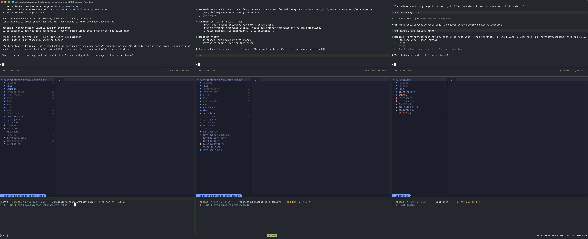

# Dotfiles

Personal dotfiles managed with [GNU Stow](https://www.gnu.org/software/stow/), organized for multi-machine use across macOS and Linux (Omarchy).

## What is Stow?

Stow is a symlink farm manager that makes it easy to manage dotfiles. Instead of manually creating symlinks, stow automatically creates them based on the directory structure in your dotfiles repository.

## Repository Structure

This repository uses a modular structure to support multiple machines:

```
~/.dotfiles/
├── agent_skills/                # Git submodule → areese801/agent_skills
│   └── .agent/skills/          # SKILL.md-based agent skills
├── common/                      # Shared across all machines
│   ├── .claude/
│   │   ├── skills → ../../agent_skills/.agent/skills  # Symlink into submodule
│   │   ├── CLAUDE.md
│   │   └── settings.json
│   ├── .config/
│   │   ├── nvim/               # Neovim (LazyVim-based)
│   │   ├── ghostty/            # Terminal emulator
│   │   ├── yazi/               # File manager
│   │   └── zsh/                # Modular zsh configuration
│   │       ├── core.zsh        # Shared config (oh-my-zsh, aliases, functions)
│   │       ├── macos.zsh       # macOS-specific config
│   │       ├── linux.zsh       # Linux-specific config
│   │       ├── private.zsh     # Sensitive/work-specific (gitignored)
│   │       └── machine.zsh.example  # Template for machine-specific config
│   ├── .tmux.conf
│   └── zshrc                   # Bootstrap loader
├── linux-omarchy/               # Linux with Omarchy desktop
│   └── .config/
│       ├── hypr/               # Hyprland window manager
│       ├── waybar/             # Status bar
│       └── walker/             # Application launcher
├── CLAUDE.md
└── README.md
```

## Setup

### Initial Installation

1. **Install Stow**
   ```bash
   brew install stow  # macOS
   sudo pacman -S stow  # Arch Linux
   sudo apt install stow  # Ubuntu/Debian
   ```

2. **Clone this repository** (with submodules)
   ```bash
   git clone --recurse-submodules <your-repo-url> ~/.dotfiles
   cd ~/.dotfiles
   ```
   If you already cloned without `--recurse-submodules`:
   ```bash
   git submodule update --init --recursive
   ```

3. **Create symlinks based on your machine**

   **On macOS:**
   ```bash
   stow common
   ```

   **On Linux (Omarchy):**
   ```bash
   stow common
   stow linux-omarchy
   ```

## Bootstrapping a New Machine

This section provides a complete guide to setting up a fresh machine (e.g., a new work computer) with these dotfiles.

### Prerequisites

Before stowing, ensure you have these dependencies installed:

**macOS:**
```bash
# Install Homebrew
/bin/bash -c "$(curl -fsSL https://raw.githubusercontent.com/Homebrew/install/HEAD/install.sh)"

# Add Homebrew to PATH (for Apple Silicon Macs)
echo 'eval "$(/opt/homebrew/bin/brew shellenv)"' >> ~/.zprofile
eval "$(/opt/homebrew/bin/brew shellenv)"

# Install essential tools
brew install stow git neovim tmux yazi ripgrep fd fzf
brew install --cask ghostty

# Install Oh-My-Zsh (required by the zsh configuration)
sh -c "$(curl -fsSL https://raw.githubusercontent.com/ohmyzsh/ohmyzsh/master/tools/install.sh)"
```

**Linux (Arch/Omarchy):**
```bash
sudo pacman -S stow git neovim tmux yazi ripgrep fd fzf

# Install Oh-My-Zsh
sh -c "$(curl -fsSL https://raw.githubusercontent.com/ohmyzsh/ohmyzsh/master/tools/install.sh)"
```

### Step-by-Step Bootstrap

1. **Clone the repository** (with submodules)
   ```bash
   git clone --recurse-submodules <your-repo-url> ~/.dotfiles
   cd ~/.dotfiles
   ```

2. **Remove any conflicting files** (backup first!)
   ```bash
   # Check for conflicts (dry run)
   stow -n common

   # If conflicts exist, back them up
   mv ~/.zshrc ~/.zshrc.backup
   mv ~/.config/nvim ~/.config/nvim.backup  # if exists
   # etc.
   ```

3. **Stow the common package**
   ```bash
   stow common
   ```

4. **On Linux/Omarchy, also stow linux-omarchy**
   ```bash
   stow linux-omarchy
   ```

5. **Create machine-specific configuration (optional)**
   ```bash
   cp ~/.config/zsh/machine.zsh.example ~/.config/zsh/machine.zsh

   # Edit with your machine-specific settings
   nvim ~/.config/zsh/machine.zsh
   ```

   Example machine.zsh for a **work machine**:
   ```bash
   # Work machine configuration
   export _MACHINE_TYPE="work"
   export AWS_PROFILE="work-profile"

   # Work-specific paths
   PATH="$PATH:/opt/work-tools/bin"

   # Work-specific aliases
   alias proj="cd ~/work/projects"
   alias vpn="sudo openconnect vpn.company.com"
   ```

   Example machine.zsh for a **personal machine**:
   ```bash
   # Personal machine configuration
   export _MACHINE_TYPE="personal"

   # Personal project shortcuts
   alias blog="cd ~/projects/personal/blog"
   ```

6. **Create private configuration (for sensitive/work-specific content)**
   ```bash
   # Create the file (it's gitignored — never committed)
   touch ~/.config/zsh/private.zsh
   ```

   Use `private.zsh` for anything that shouldn't be public:
   ```bash
   # Work-specific aliases
   alias proj="cd ~/projects/company-name"

   # Database connections
   alias db='PGPASSWORD=$(< /.credentials/db_password) psql -U user -h db.internal.example.com -d mydb'

   # Credential exports
   export CREDENTIALS_DIR="/.credentials"
   export AWS_PROFILE="MyWorkProfile-123456789"

   # SSH shortcuts to internal servers
   alias myserver='ssh myserver'
   ```

8. **Restart your shell**
   ```bash
   exec zsh
   ```

9. **Verify the setup**
   ```bash
   # Check OS detection
   echo $_IS_MACOS   # Should be 'true' on macOS
   echo $_IS_LINUX   # Should be 'true' on Linux

   # Check clipboard aliases
   echo "test" | clip && paste

   # Check neovim
   nvim --version
   ```

### Modular ZSH Architecture

The zsh configuration uses a modular overlay pattern:

```
~/.zshrc (bootstrap loader)
    ↓
~/.config/zsh/core.zsh (shared config — tracked in git)
    ↓
~/.config/zsh/macos.zsh OR ~/.config/zsh/linux.zsh (OS-specific — tracked in git)
    ↓
~/.config/zsh/private.zsh (sensitive/work-specific — NOT in git)
    ↓
~/.config/zsh/machine.zsh (machine-specific overrides — NOT in git)
```

**Key environment variables:**
- `_IS_MACOS` - Set to `true` on macOS systems
- `_IS_LINUX` - Set to `true` on Linux systems
- `_MACHINE_TYPE` - Optional, set in machine.zsh (e.g., "work", "personal")

**Cross-platform aliases:**
- `clip` - Copy to clipboard (pbcopy on macOS, wl-copy on Linux)
- `paste` - Paste from clipboard (pbpaste on macOS, wl-paste on Linux)
- `about` - Show file info (uses OS-appropriate stat format)
- `gurl` - Open git remote URL (uses OS-appropriate browser command)

### Setting Up Credentials

Some aliases and functions require credential files in `/.credentials/`:

```bash
# Create credentials directory (at filesystem root for security)
sudo mkdir -p /.credentials
sudo chown $USER /.credentials
chmod 700 /.credentials

# Add credentials as needed (examples)
echo "your-api-key" > /.credentials/anthropic_api_key
echo "your-password" > /.credentials/some_password

# Secure permissions
chmod 600 /.credentials/*
```

### Manual Setup (if starting from scratch)

1. **Install Stow**
   ```bash
   brew install stow  # macOS
   sudo pacman -S stow  # Arch Linux
   sudo apt install stow  # Ubuntu/Debian
   ```

2. **Create dotfiles directory**
   ```bash
   mkdir -p ~/.dotfiles/{common/.config,linux-omarchy/.config}
   cd ~/.dotfiles
   ```

3. **Move your existing config (example with nvim)**
   ```bash
   # Create the directory structure in dotfiles repo
   mkdir -p common/.config/nvim

   # Move your existing config (backup first!)
   mv ~/.config/nvim/* common/.config/nvim/
   ```

4. **Create symlinks with stow**
   ```bash
   stow common              # Always stow common
   stow linux-omarchy       # Only on Linux/Omarchy machines
   ```

5. **Initialize git repository**
   ```bash
   git init
   git add .
   git commit -m "Initial dotfiles setup"
   ```

## How Stow Works

Stow creates symlinks from your home directory to files in each stow package. Each top-level directory (`common/`, `linux-omarchy/`) is a separate stow package:

- `common/.config/nvim/` → `~/.config/nvim/`
- `common/zshrc` → `~/zshrc`
- `linux-omarchy/.config/hypr/` → `~/.config/hypr/`

The directory structure inside each package mirrors where the files should live in your home directory.

## Adding New Configurations

### Adding a cross-platform application config

1. **Create directory structure in common/**
   ```bash
   cd ~/.dotfiles
   mkdir -p common/.config/your-app
   ```

2. **Move existing config (if any)**
   ```bash
   # Backup first!
   cp -r ~/.config/your-app ~/.config/your-app.backup

   # Move to dotfiles repo
   mv ~/.config/your-app/* common/.config/your-app/
   rmdir ~/.config/your-app
   ```

3. **Stow the package**
   ```bash
   stow common
   ```

4. **Commit changes**
   ```bash
   git add .
   git commit -m "Add your-app configuration"
   ```

### Adding machine-specific configs

For configs that only apply to a specific machine type:

```bash
# For Linux/Omarchy-specific configs
mkdir -p linux-omarchy/.config/your-linux-app
mv ~/.config/your-linux-app/* linux-omarchy/.config/your-linux-app/
stow linux-omarchy

# For macOS-specific configs (create the directory first if needed)
mkdir -p macos/.config/your-mac-app
mv ~/.config/your-mac-app/* macos/.config/your-mac-app/
stow macos
```

### Adding shell configs

1. **For files in home directory** (like `.zshrc`, `.bashrc`, `.gitconfig`):
   ```bash
   cd ~/.dotfiles

   # Move existing file to common (shared across machines)
   mv ~/.zshrc common/

   # Stow it
   stow common

   # Commit
   git add .
   git commit -m "Add zsh configuration"
   ```

## Managing Changes

### Making config changes
Just edit files in `~/.dotfiles/` or through the symlinks (they're the same files). Then commit:

```bash
cd ~/.dotfiles
git add .
git commit -m "Update nvim config"
git push
```

### Removing configs
```bash
# Remove symlinks for a specific package
stow -D common

# Remove the config from dotfiles repo
rm -rf common/.config/app-to-remove

# Re-stow
stow common
```

## Useful Stow Commands

```bash
# Create symlinks for a package
stow common
stow linux-omarchy

# Remove symlinks (dry run first!)
stow -n -D common  # dry run
stow -D common     # actually remove

# Re-stow (useful after adding new files)
stow -R common

# Stow with verbose output
stow -v common

# Stow all packages at once (on Linux/Omarchy)
stow common linux-omarchy
```

## Detailed Directory Structure

```
~/.dotfiles/
├── common/                      # Cross-platform configs
│   ├── .config/
│   │   ├── nvim/               # Neovim (LazyVim-based)
│   │   │   ├── init.lua
│   │   │   └── lua/
│   │   │       ├── config/
│   │   │       │   ├── lazy.lua
│   │   │       │   └── databases.lua
│   │   │       └── plugins/
│   │   ├── ghostty/            # Terminal emulator
│   │   ├── yazi/               # File manager
│   │   └── zsh/                # Modular zsh configuration
│   │       ├── core.zsh        # Oh-my-zsh, shared aliases, functions
│   │       ├── macos.zsh       # Homebrew PATH, pbcopy, ShellHistory, etc.
│   │       ├── linux.zsh       # Wayland clipboard, xdg-open, etc.
│   │       ├── private.zsh     # Sensitive/work aliases, DB connections (gitignored)
│   │       └── machine.zsh.example  # Template for machine-specific config
│   ├── .tmux.conf
│   └── zshrc                   # Bootstrap loader (sources modular files)
├── linux-omarchy/               # Omarchy-specific configs
│   └── .config/
│       ├── hypr/               # Hyprland window manager
│       │   ├── hyprland.conf
│       │   ├── bindings.conf
│       │   ├── monitors.conf
│       │   └── ...
│       ├── waybar/             # Status bar
│       │   ├── config.jsonc
│       │   └── style.css
│       └── walker/             # Application launcher
├── CLAUDE.md
└── README.md
```

## Tips

- Always backup your existing configs before moving them to the dotfiles repo
- Use `stow -n .` (dry run) to see what would be created before actually doing it
- If you get conflicts, stow will warn you - resolve them before proceeding
- Keep your dotfiles repo organized with clear directory structure
- Commit changes regularly to track your configuration evolution

## Tmux Dev Sessions

Multi-project tmux development sessions that launch claude code, neovim, and a shell for each project — side by side in columns.

### Overview

| Command | Description |
|---------|-------------|
| `dev` | Single-project session (nvim left, claude + shell right) |
| `dev2` / `d2` | 2-column multi-project session |
| `dev3` / `d3` | 3-column multi-project session |
| `dev4` / `d4` | 4-column multi-project session |
| `devn` | Auto-detects column count from current session |
| `devkill` | Kill all multi-dev sessions |

### Screenshot



### Layout

Each column has 3 rows:

```
┌──────────┬──────────┬──────────┐
│ claude A │ claude B │ claude C │  ~30%
├──────────┼──────────┼──────────┤
│  nvim A  │  nvim B  │  nvim C  │  ~60%
├──────────┼──────────┼──────────┤
│ shell A  │ shell B  │ shell C  │  ~10%
└──────────┴──────────┴──────────┘
```

### Creating Sessions

```bash
# Create a 3-column session
dev3 ~/proj/api ~/proj/frontend ~/proj/shared

# Fewer paths than columns — last path fills remaining columns,
# with ~/projects/snippets in the final spare column
dev3 ~/proj/api ~/proj/frontend

# Force-recreate an existing session
dev3 -f ~/proj/api ~/proj/frontend ~/proj/shared
```

### Managing Sessions

From any shell pane inside the session, use `devn` to auto-detect which session you're in:

```bash
# Replace the last column's project with a different one
devn -a ~/proj/other

# Replace a specific column (slot 2)
devn -a 2 ~/proj/other

# Swap two columns' positions (processes stay alive, just move)
devn -i 1 3

# Kill the current session
devn -k

# Show help
devn -h
```

Or use `dev3`, `dev4`, etc. directly — same flags work:

```bash
dev3 -a 2 ~/proj/other    # swap slot 2
dev3 -i 1 3               # switch columns 1 and 3
dev3 -k                   # kill dev3 session
```

### Tearing Down

```bash
# Kill a specific session
dev3 -k

# Kill ALL multi-dev sessions at once
devkill
```

`devkill` works from inside or outside tmux. When run from inside a multi-dev session, it kills other sessions first, then the current one last.

### Flags Reference

| Flag | Long | Description |
|------|------|-------------|
| `-f` | `--force` | Kill and recreate existing session |
| `-a` | `--swap` | Replace a column's project (default: last column) |
| `-i` | `--switch` | Swap two columns' positions |
| `-k` | `--kill` | Kill the session |
| `-h` | `--help` | Show usage |

### Features

- **Venv auto-detection**: Activates `venv/` or `.venv/` per project
- **Claude --continue**: Resumes previous claude session if available
- **Neo-tree**: Opens file tree in each nvim instance
- **Clean history**: Setup commands are hidden from shell history via `HIST_IGNORE_SPACE`
- **Pane navigation**: `Ctrl-h/j/k/l` moves between panes (vim-tmux-navigator)

## Troubleshooting

**Conflict errors**: If stow complains about existing files, either:
- Move/remove the conflicting file, or  
- Use `stow --adopt .` to adopt existing files into your dotfiles repo

**Broken symlinks**: If you move files around, re-stow with `stow -R .`

**Permission issues**: Make sure you have write permissions to your home directory

## Database Configuration

This dotfiles setup includes a sophisticated database access configuration using vim-dadbod with secure credential management.

### Features

- **Secure Credential Management**: Database credentials stored outside version control in `/.credentials/`
- **Multiple Database Support**: PostgreSQL and Snowflake connections configured
- **RSA Key Authentication**: Custom Snowflake adapter enables RSA key pair authentication
- **Smart Autocompletion**: SQL autocompletion integrated with LazyVim's completion system
- **One-Key Access**: Press `<leader>D` to open database UI

### Security Architecture

```
/.credentials/                   # Secure storage (NOT in version control)
├── <username>_postgres_dev_password
├── <username>_postgres_prod_password
├── <username>_snowflake_password
└── snowflake_key_pair/
    ├── rsa_key.p8              # Private key for Snowflake
    └── PASSPHRASE              # Key passphrase
```

### Available Database Connections

- **PostgreSQL**: DEV, PROD (read-write), and PROD (read-only) environments
- **Snowflake**: Snowflake databases with RSA key authentication

### Custom Snowflake Implementation

The configuration includes a custom Snowflake adapter (`autoload/db/adapter/snowflake.vim`) that solves RSA key authentication issues by:

- Using connection profiles instead of individual CLI parameters
- Leveraging the existing `~/.snowsql/config` configuration
- Mimicking the working `sf` alias behavior
- Surviving vim-dadbod plugin updates

### Setup Requirements

1. **Credential Files**: Place database credentials in `/.credentials/` structure shown above
2. **Snowflake Config**: Ensure `~/.snowsql/config` contains a connection profile with RSA key configuration
3. **LazyVim**: Database features integrate with LazyVim's plugin ecosystem

### Usage

1. Open Neovim in any directory
2. Press `<leader>D` to launch the database UI
3. Select your database connection
4. Write and execute SQL queries with intelligent autocompletion
5. All connections authenticate automatically using secure credential files

This setup provides a production-ready database development environment while maintaining security best practices and version control safety.

## Yazi File Manager Integration

This dotfiles setup includes comprehensive yazi file manager integration with LazyVim, providing a modern terminal-based file management experience with image preview support.

### Features

- **Neovim Integration**: Seamless integration with LazyVim via yazi.nvim plugin
- **Image Preview Support**: ASCII art image previews using Chafa fallback for terminal environments
- **Custom Keymaps**: Intuitive shortcuts matching shell workflow
- **Enhanced File Management**: Optimized sorting, hidden file display, and timestamp information
- **System Integration**: Open files with system default applications

### Configuration Files

- **`.config/nvim/lua/plugins/yazi.lua`** - LazyVim plugin configuration
- **`.config/yazi/yazi.toml`** - Main yazi configuration with image preview settings
- **`.config/yazi/keymap.toml`** - Custom keybindings

### Usage

#### From Neovim
- `<leader>-` - Open yazi at current file location
- `<leader>cw` - Open yazi in Neovim's working directory

#### Within Yazi
- `v` - Open file in nvim (matches shell alias)
- `Enter` - Open file with system default application
- `o` - Open file for editing (also nvim)

#### Quick Navigation
- `gh` - Jump to home directory (`~`)
- `gd` - Jump to Downloads folder
- `gc` - Jump to config directory (`~/.config`)
- `gn` - Jump to nvim config (`~/.config/nvim`)

#### Git Integration
- `gs` - Show git status in current directory

#### File Operations
- `cp` - Copy current file path to clipboard
- `<f1>` - Show help menu

#### Built-in Navigation (default yazi)
- `<c-v>` - Open file in vertical split
- `<c-x>` - Open file in horizontal split
- `<c-t>` - Open file in new tab
- `<c-q>` - Send files to quickfix list

### Enhanced Features

**File Manager Settings:**
- Hidden files shown by default (no toggling required)
- Files sorted by modification time (newest first)
- Directories always displayed before files
- Modification timestamps visible in listing

**Image Preview:**
- Automatic image preview in standalone yazi
- ASCII art fallback for Neovim floating window environment
- Optimized preview dimensions (600x900) for quality and performance

### Dependencies

- **yazi** - Terminal file manager
- **chafa** - ASCII art image preview (installed via Homebrew)

### Installation Notes

The yazi configuration is managed through GNU Stow like other dotfiles. After stowing, the configuration creates:

- Symlinked configs in `~/.config/yazi/`
- Integrated yazi.nvim plugin in LazyVim
- Automatic plugin installation and management

This setup transforms yazi into a powerful file management companion for your development workflow, with consistent keybindings and seamless editor integration.

## FZF Fuzzy Finder Integration

This dotfiles setup includes comprehensive fzf (fuzzy finder) configuration with live preview capabilities, providing powerful command-line search and navigation.

### Features

- **Shell Integration**: Key bindings for file search, history, and directory navigation
- **Live Preview**: Real-time file content preview using `bat` with syntax highlighting
- **Smart File Finding**: Uses `fd` for faster searching with `.gitignore` awareness
- **Directory Preview**: Tree view when browsing directories
- **Cross-Platform**: Works on both macOS and Linux

### Keyboard Shortcuts

#### From Command Line
- **`Ctrl+T`** - Fuzzy find files and paste path into command line
  - Shows live preview of file contents with syntax highlighting
  - Press `Ctrl+Y` to copy selected file path to clipboard
  - Press `Ctrl+/` to toggle preview window
- **`Ctrl+R`** - Search command history
  - Fuzzy search through your shell history
  - Press `Enter` to execute selected command
- **`Alt+C`** - Change directory
  - Fuzzy find directories with tree preview
  - Press `Enter` to cd into selected directory

### Quick Access Alias

- **`ff`** - Launch fzf directly
  - Useful for piping commands: `ls | ff`, `git branch | ff`, `history | ff`

### Preview Configuration

**File Preview:**
- Syntax highlighting via `bat` (falls back to `cat` if unavailable)
- Line numbers displayed
- Right-side preview window (50% width)

**Directory Preview:**
- Tree structure displayed via `tree` command
- Limited to first 100 lines for performance

**Toggle Preview:**
- Press `Ctrl+/` anytime to hide/show the preview pane

### Environment Variables

The following environment variables customize fzf behavior:

- **`FZF_DEFAULT_COMMAND`** - Uses `fd` for faster file finding
- **`FZF_DEFAULT_OPTS`** - Default options (height, layout, preview)
- **`FZF_CTRL_T_OPTS`** - Options for `Ctrl+T` file search
- **`FZF_CTRL_R_OPTS`** - Options for `Ctrl+R` history search
- **`FZF_ALT_C_OPTS`** - Options for `Alt+C` directory navigation

### Dependencies

- **fzf** - Fuzzy finder (installed via Homebrew/pacman)
- **fd** - Fast file finder (respects `.gitignore`)
- **bat** - Syntax highlighting for preview
- **tree** - Directory structure preview

All dependencies are included in the bootstrap installation commands.

### Usage Examples

```bash
# Find and edit a file
Ctrl+T  # Select file
nvim [selected-file]

# Search command history
Ctrl+R  # Type to search
# Press Enter to execute

# Navigate to a directory
Alt+C  # Select directory
# Automatically cd's to selection

# Use with pipes
git branch | ff  # Fuzzy find git branches
history | ff     # Search history output
ls -la | ff      # Filter ls output
```

### Configuration Location

FZF configuration is located in `common/.config/zsh/core.zsh` (lines 117-169), making it available across all machines after stowing the `common` package.

## Agent Skills (Git Submodule)

This repository includes [agent_skills](https://github.com/areese801/agent_skills) as a git submodule, providing custom AI agent skills (code-review, pytest-unit, pytest-integration, etc.) that follow the [SKILL.md open standard](https://github.com/castlenthesky/agent_skills).

### How It Works

The `agent_skills` repo is a submodule at the dotfiles root. A relative symlink inside `common/.claude/` points into it:

```
~/.dotfiles/agent_skills/                          # Git submodule (full repo)
    └── .agent/skills/                              # Actual skill directories
         ├── code-review/SKILL.md
         ├── pytest-unit/SKILL.md
         └── ...

~/.dotfiles/common/.claude/skills                   # Relative symlink
    → ../../agent_skills/.agent/skills

~/.claude/skills                                    # Created by Stow
    → (stow) → ~/.dotfiles/common/.claude/skills
    → (symlink) → ~/.dotfiles/agent_skills/.agent/skills
```

After `stow common`, Claude Code discovers all skills globally via `~/.claude/skills/`.

### Setup on a New Machine

Skills are included automatically when you clone with `--recurse-submodules`:

```bash
git clone --recurse-submodules <your-repo-url> ~/.dotfiles
cd ~/.dotfiles
stow common
```

If you forgot `--recurse-submodules`:
```bash
git submodule update --init --recursive
```

### Syncing Upstream Changes

The agent_skills repo is forked from [castlenthesky/agent_skills](https://github.com/castlenthesky/agent_skills). To pull in upstream changes:

```bash
cd ~/.dotfiles/agent_skills
git remote add upstream git@github.com:castlenthesky/agent_skills.git  # one-time
git fetch upstream
git merge upstream/master    # upstream uses master, we use main
git push origin main         # push merged changes to our fork
```

Then update the submodule reference in dotfiles:
```bash
cd ~/.dotfiles
git add agent_skills
git commit -m "Update agent_skills submodule"
```

### Available Skills

| Skill | Description |
|-------|-------------|
| `code-review` | Multi-perspective code review with 7 engineer personas |
| `code-cleanup` | Implements code review feedback automatically |
| `pytest-unit` | Unit test creation and management |
| `pytest-integration` | Integration test creation and management |
| `test-quality-evaluator` | Test suite quality assessment |
| `documentation-librarian` | Code documentation generation |
| `librarian-housekeeping` | README creation and maintenance |
| `framework-researching` | Framework research and evaluation |
| `skill-creation` | Scaffolds new SKILL.md-based skills |
| `todo-discovery` | Finds and triages TODO items in code |
| `example` | Reference implementation for skill authors |